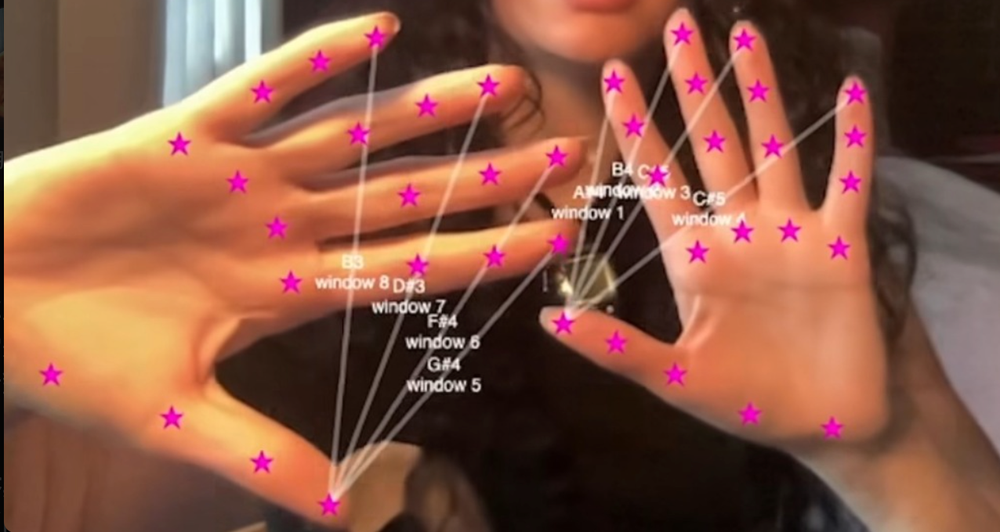

# 手勢辨識技術方案

## 目錄

1. [技術方案總覽](#技術方案總覽)
2. [骨架追蹤類 (21 點)](#骨架追蹤類-21-點)
3. [物件偵測類 (Bounding Box)](#物件偵測類-bounding-box)
4. [深度相機專用方案](#深度相機專用方案)
5. [Mac M4 開發策略](#mac-m4-開發策略)
6. [開發建議](#開發建議)

---

## 技術方案總覽

手勢辨識可依照「輸出類型」分為三大類：

| 類型               | 輸出          | 優點                  | 缺點               | 代表技術                  |
| ------------------ | ------------- | --------------------- | ------------------ | ------------------------- |
| **骨架追蹤** | 21 個關節座標 | 精確、可辨識複雜手勢  | 運算量大、容易抖動 | MediaPipe, MMPose         |
| **物件偵測** | 方框 + 標籤   | 快速、穩定            | 只能辨識預定義手勢 | YOLO, Haar Cascade        |
| **深度分析** | 距離/形狀     | 不需光線、Mac M4 穩定 | 需深度相機         | PointNet, Depth Threshold |

---

## 骨架追蹤類 (21 點)

追蹤手掌上每個關節的 2D/3D 座標，能辨識精細手勢（如：數字 1-5、比讚、OK）。



### MediaPipe Hands (Google)

| 屬性             | 說明                                                 |
| ---------------- | ---------------------------------------------------- |
| **技術**   | Google AI 視覺模型                                   |
| **輸入**   | RGB 影像                                             |
| **輸出**   | 21 個關節點座標 (x, y, z)                            |
| **優點**   | 極精準、免費、跨平台                                 |
| **缺點**   | 需良好光線、手重疊會亂                               |
| **Mac M4** | ✅ AI 推論可行，⚠️ 需替代相機 (RealSense RGB 不穩) |

```python
import cv2
import mediapipe as mp

cap = cv2.VideoCapture(0)  # USB Webcam
mp_hands = mp.solutions.hands
hands = mp_hands.Hands()

while cap.isOpened():
    ret, frame = cap.read()
    results = hands.process(cv2.cvtColor(frame, cv2.COLOR_BGR2RGB))

    if results.multi_hand_landmarks:
        for hand_landmarks in results.multi_hand_landmarks:
            for landmark in hand_landmarks.landmark:
                x, y = landmark.x, landmark.y  # 0~1 正規化座標
```

### MMPose (OpenMMLab)

| 屬性           | 說明                        |
| -------------- | --------------------------- |
| **技術** | 學術框架，支援多種 backbone |
| **輸入** | RGB 影像                    |
| **輸出** | 可自定義 (5~42 點)          |
| **優點** | 高度可客製化、支援訓練      |
| **缺點** | 安裝複雜、需 GPU            |
| **適合** | 需要自定義關鍵點的進階專案  |

### 其他選項

| 模型                    | 特色                         |
| ----------------------- | ---------------------------- |
| **OpenPose**      | 全身 + 手部骨架，運算量較大  |
| **DeepLabCut**    | 可自定義標記點，適合特殊手勢 |
| **InterHand2.6M** | 專門處理雙手互動/重疊場景    |

---

## 物件偵測類 (Bounding Box)

不追蹤個別關節，而是直接偵測整個手，輸出一個方框和分類標籤。

### YOLO 手勢偵測 (推薦)

| 屬性             | 說明                                            |
| ---------------- | ----------------------------------------------- |
| **技術**   | YOLOv8 / YOLOv10 物件偵測                       |
| **輸入**   | RGB 影像                                        |
| **輸出**   | 方框座標 + 手勢標籤 (如：Five, Fist, Thumbs_Up) |
| **優點**   | 極快 (100+ FPS)、穩定、不抖動                   |
| **缺點**   | 需自行訓練或找預訓練模型                        |
| **Mac M4** | ✅ 完美支援                                     |

```python
from ultralytics import YOLO

model = YOLO("hand_gesture.pt")  # 預訓練或自訓練模型
results = model.predict(source=0, show=True)  # 0 = Webcam

for r in results:
    for box in r.boxes:
        label = model.names[int(box.cls)]  # e.g., "Five", "Fist"
        conf = box.conf.item()
        print(f"偵測到: {label}, 信心度: {conf:.2f}")
```

**預訓練資源**：

- [Roboflow Hand Gesture Dataset](https://universe.roboflow.com/hand-gesture)
- [Kaggle Hand Gesture Recognition](https://www.kaggle.com/datasets)

### Handtrack.js

| 屬性           | 說明                           |
| -------------- | ------------------------------ |
| **技術** | 輕量化 JavaScript 偵測庫       |
| **輸入** | RGB 影像 (瀏覽器)              |
| **輸出** | 手的中心點座標 + 速度          |
| **優點** | 超輕量、可在瀏覽器運行         |
| **適合** | 只需要「手的位置」而非具體手勢 |

### Haar Cascades (OpenCV)

| 屬性           | 說明                       |
| -------------- | -------------------------- |
| **技術** | 傳統機器學習 (Viola-Jones) |
| **輸入** | RGB / 灰階影像             |
| **輸出** | 方框座標                   |
| **優點** | 不需 GPU、完全離線         |
| **缺點** | 準確度較低、容易誤判       |

```python
import cv2

palm_cascade = cv2.CascadeClassifier('palm.xml')
cap = cv2.VideoCapture(0)

while True:
    ret, frame = cap.read()
    gray = cv2.cvtColor(frame, cv2.COLOR_BGR2GRAY)
    palms = palm_cascade.detectMultiScale(gray, 1.3, 5)

    for (x, y, w, h) in palms:
        cv2.rectangle(frame, (x, y), (x+w, y+h), (0, 255, 0), 2)
```

---

## 深度相機專用方案

使用 RealSense D435 的深度資料，**不依賴光線**，適合夜間或 Mac M4 (RGB 不穩) 環境。

### Depth Thresholding (推薦 - 最穩定)

| 屬性             | 說明                           |
| ---------------- | ------------------------------ |
| **技術**   | 深度距離切割                   |
| **輸入**   | Depth 影像                     |
| **輸出**   | 手的中心點座標、距離、移動方向 |
| **優點**   | 極快、極穩定、夜間可用         |
| **缺點**   | 只能判斷簡單動作 (揮手、推拉)  |
| **Mac M4** | ✅ 最佳方案                    |

**原理**：設定一個「虛擬觸控區」，例如距離相機 30-50 公分的範圍。當手進入這個區域，追蹤它的中心點位置來控制機器狗。

```python
import pyrealsense2 as rs
import numpy as np

pipeline = rs.pipeline()
config = rs.config()
config.enable_stream(rs.stream.depth, 640, 480, rs.format.z16, 30)
pipeline.start(config)

while True:
    frames = pipeline.wait_for_frames()
    depth_frame = frames.get_depth_frame()
    depth_image = np.asanyarray(depth_frame.get_data())

    # 找出 30-50 公分範圍內的物體
    mask = (depth_image > 300) & (depth_image < 500)  # 單位: mm

    # 計算中心點
    if np.any(mask):
        coords = np.argwhere(mask)
        center_y, center_x = coords.mean(axis=0)
        print(f"手的位置: ({center_x:.0f}, {center_y:.0f})")
```

### Hand-Point-Net / PointNet

| 屬性           | 說明                |
| -------------- | ------------------- |
| **技術** | 3D 點雲神經網路     |
| **輸入** | Depth 點雲          |
| **輸出** | 手勢分類 / 關節座標 |
| **優點** | 不需光線、3D 精確   |
| **缺點** | 運算量大、需 GPU    |

---

## Mac M4 開發策略

> [!IMPORTANT]
> Mac M4 上 RealSense 的 RGB 串流不穩定，但 AI 推論能力極強。

### 問題與解法

| 問題               | 解法                                   |
| ------------------ | -------------------------------------- |
| RealSense RGB 報錯 | 使用替代相機 (USB Webcam / iPhone)     |
| 需要 RGB 手勢辨識  | 先用替代相機開發，之後移植到 Jetson    |
| 想避開 RGB 問題    | 使用 Depth Thresholding (完全不用 RGB) |

### 替代相機建議

| 替代相機                             | 成本      | Mac 支援 |
| ------------------------------------ | --------- | -------- |
| **Mac 內建 FaceTime 相機**     | $0        | ✅ 完美  |
| **任意 USB Webcam**            | ~$300-500 | ✅ 完美  |
| **iPhone (Continuity Camera)** | $0        | ✅ 完美  |

### 開發流程

```
Phase 1: Mac M4 開發
┌─────────────┐     ┌─────────────┐     ┌─────────────┐
│ USB Webcam  │ ──▶ │  YOLO 或    │ ──▶ │  手勢邏輯   │
│ (任意相機)   │     │  MediaPipe  │     │  (你的程式) │
└─────────────┘     └─────────────┘     └─────────────┘

Phase 2: Jetson 部署
┌─────────────┐     ┌─────────────┐     ┌─────────────┐
│ RealSense   │ ──▶ │  同樣模型   │ ──▶ │  同樣程式   │
│ D435 (RGB)  │     │             │     │             │
└─────────────┘     └─────────────┘     └─────────────┘
                          +
                   RealSense Depth
                   (距離過濾：忽略遠處路人)
```

---

## 開發建議

### 依場景選擇

| 場景                      | 推薦方案             | 原因                          |
| ------------------------- | -------------------- | ----------------------------- |
| **Mac M4 快速開發** | YOLO + USB Webcam    | 速度快、穩定、程式碼簡單      |
| **夜間 / 無光環境** | Depth Thresholding   | 完全不需光線，穩定性最高      |
| **精確手指辨識**    | MediaPipe (替代相機) | 21 點骨架最精準               |
| **機器狗原力控制**  | Depth Thresholding   | 只需手的位置、不需具體手勢    |
| **Jetson 最終部署** | MediaPipe + Depth    | RGB 辨識手勢 + Depth 過濾距離 |

### 專題推薦路徑

1. **Phase 1**：先用 **Depth Thresholding** 做簡單的「虛擬按鈕區」

   - 手伸到前方 30cm → 機器狗停下
   - 手左右移動 → 機器狗轉向
2. **Phase 2**：加入 **YOLO 手勢分類**

   - 偵測「比讚」→ 機器狗開始跟隨
   - 偵測「握拳」→ 機器狗後退
3. **Phase 3** (進階)：混合 **MediaPipe + Depth**

   - 精確辨識手指數字 (1-5)
   - 結合距離過濾，只偵測 1 公尺內的手

---

## 相關檔案

- [SKILL.md](../SKILL.md) - 主入口，開發環境設定指南
- [realsense_d435_features.md](./realsense_d435_features.md) - RealSense D435 硬體功能說明
