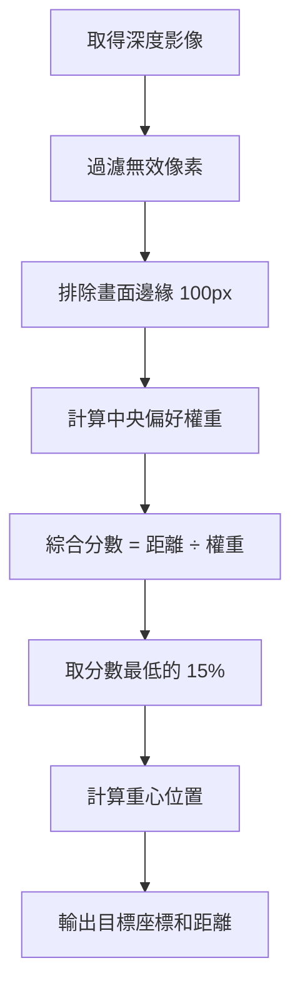

# 🚶‍♂️ 人物跟隨模擬器 (Follow Person Simulator)

基於深度攝影機的人物跟隨功能，讓機器狗能自動追蹤並保持與目標的距離。

## 功能特點

| 功能             | 說明                                   |
| ---------------- | -------------------------------------- |
| **距離控制**     | 太近停下、太遠跟上、適中保持           |
| **轉向追蹤**     | 目標偏左/右時自動轉向修正              |
| **中央偏好偵測** | 優先追蹤畫面中央物體，避免誤鎖旁邊牆壁 |
| **視覺化 UI**    | 追蹤框、距離條、速度箭頭               |

---

## 執行方式

```bash
sudo /Users/yamiko/Documents/VsCode/Go2_Project/.venv/bin/python /Users/yamiko/Documents/VsCode/Go2_Project/camera/demo/follow_person.py
```

> [!NOTE]
> macOS 需要 `sudo` 權限才能存取 USB 裝置。

---

## 參數設定

### 距離閾值

| 參數              | 預設值 | 說明              |
| ----------------- | ------ | ----------------- |
| `STOP_DISTANCE`   | 0.6m   | 小於此距離 → 停下 |
| `FOLLOW_DISTANCE` | 1.2m   | 大於此距離 → 跟上 |
| `IDEAL_DISTANCE`  | 0.9m   | 理想保持距離      |
| `MAX_DISTANCE`    | 3.0m   | 最大偵測距離      |

### 轉向參數

| 參數              | 預設值 | 說明                   |
| ----------------- | ------ | ---------------------- |
| `CENTER_DEADZONE` | 30px   | 死區範圍，在此內不轉向 |
| `ANGULAR_GAIN`    | 0.005  | 轉向增益，越大越靈敏   |
| `MAX_ANGULAR_Z`   | 0.6    | 最大轉向速度 (rad/s)   |

---

## 輸出格式

程式有兩種輸出，分別給機器和人讀：

### 終端機輸出（機器可讀）

```
[KEEP] dist:0.88 x:0.00 z:-0.15 blob:10469
📊 [FollowPerson] 記憶體: 280.0MB | CPU: 26.6% | 運行: 61s
```

| 欄位   | 說明                                    |
| ------ | --------------------------------------- |
| `dist` | 目標距離（公尺）                        |
| `x`    | `linear_x` 前進速度 (0~0.5)             |
| `z`    | `angular_z` 轉向速度 (正=左轉, 負=右轉) |
| `blob` | 偵測到的物體大小（像素數）              |

### 視窗 UI（人讀）

畫面底部顯示人類可讀的狀態：

```
KEEP (0.85m)     RIGHT >>
        x:0.00 z:-0.15
```

| 顯示       | 意義               |
| ---------- | ------------------ |
| `STOP!`    | 太近，停下         |
| `KEEP`     | 保持距離           |
| `FOLLOW!`  | 太遠，跟上         |
| `<< LEFT`  | 目標在左邊，左轉追 |
| `RIGHT >>` | 目標在右邊，右轉追 |

### 動作對照表

| Action   | 條件     | linear_x | angular_z |
| -------- | -------- | -------- | --------- |
| `SEARCH` | 無目標   | 0        | 0         |
| `STOP`   | < 0.6m   | 0        | 視偏移    |
| `KEEP`   | 0.6~1.2m | 0        | 視偏移    |
| `FOLLOW` | > 1.2m   | 0.1~0.5  | 視偏移    |

---

## 開發過程遇到的問題

### 問題：轉向方向不正確

**症狀**：站在相機右邊，程式卻顯示「左轉」。

**原因**：原本的偵測邏輯是找「全畫面最近的物體」，當人站在右邊但離相機較遠時，可能會偵測到左邊更近的牆壁或家具。

```
❌ 舊邏輯：
    找最近的 10% 像素 → 可能抓到旁邊的牆
```

**解法**：加入「中央偏好權重」，讓越靠近畫面中央的物體優先被選中。

```python
# 綜合分數 = 距離 ÷ 中央權重
# 中央的人即使稍遠也會被優先選中
score = depth_meters / center_weight
```

### 問題：轉向不夠靈敏

**症狀**：目標移動後，反應遲鈍。

**解法**：調整參數

| 參數              | 調整前 | 調整後 |
| ----------------- | ------ | ------ |
| `CENTER_DEADZONE` | 50px   | 30px   |
| `ANGULAR_GAIN`    | 0.003  | 0.005  |
| `MIN_BLOB_SIZE`   | 5000   | 3000   |

---

## 演算法說明

### 目標偵測流程



### 轉向邏輯

```
目標在畫面右側 (offset_x > 0)
  → angular_z = 負值
  → 機器狗右轉追過去

目標在畫面左側 (offset_x < 0)
  → angular_z = 正值
  → 機器狗左轉追過去
```

---

## UI 說明

```
┌─────────────────────────────────────────────────────┐
│             Follow Person Simulator                 │
│                                                     │
│   ▌       ┌─────────┐                          ↑    │
│   ▌ 距離   │  追蹤框  │───────○ 目標中心        │速度 │
│   ▌  條    └─────────┘                          ↓    │
│                                                     │
│        KEEP (0.85m)              RIGHT >>          │ ← 人讀
│                   x:0.00 z:-0.15                   │ ← 機器數據
└─────────────────────────────────────────────────────┘
```

| 元素         | 說明                                     |
| ------------ | ---------------------------------------- |
| **追蹤框**   | 標記偵測到的目標位置                     |
| **距離條**   | 左側顯示目標距離（紅線=太近，綠線=太遠） |
| **速度箭頭** | 右側顯示前進/轉向指令                    |
| **主訊息**   | 大字顯示動作 + 轉向方向                  |
| **機器數據** | 小字顯示 x/z 數值（開發參考）            |

---

## 效能表現

| 指標   | 數值    |
| ------ | ------- |
| 幀率   | ~30 FPS |
| 記憶體 | ~280 MB |
| CPU    | ~25%    |
| 延遲   | < 50ms  |

---

## 未來擴展

- [ ] 整合 YOLO 人物辨識（確認是人而非物體）
- [ ] 加入速度平滑（避免抖動）
- [ ] 輸出 ROS2 `/cmd_vel` 話題
- [ ] 加入「失去目標」超時處理
